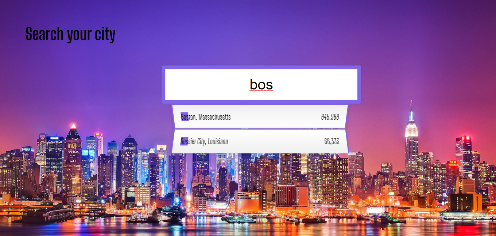

# reto-6-js-ajax

Este reto tiene como **objetivo** 🎯 la práctica de peticiones a una API, limpieza de los datos y filtrar los resultado por una búsqueda a través de un input, pintar los resultados de la petición a la api según la búsqueda
Además de continuar practicando CSS y mejorar el etiquetado para que sea más semántico y accesible

## Instalación del proyecto 🚀

Puedes clonarte el repositorio a través de este enlace, poniendo en la consola **git clone** https://github.com/adharamonzon/reto-6-js-ajax.git y abrir el servidor.

## resultado

https://github.com/adharamonzon/reto-6-js-ajax
